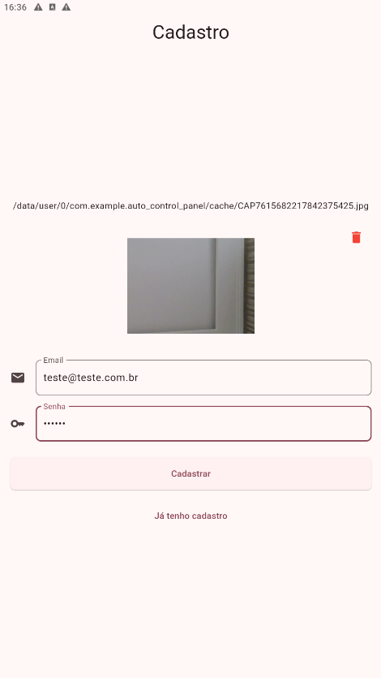
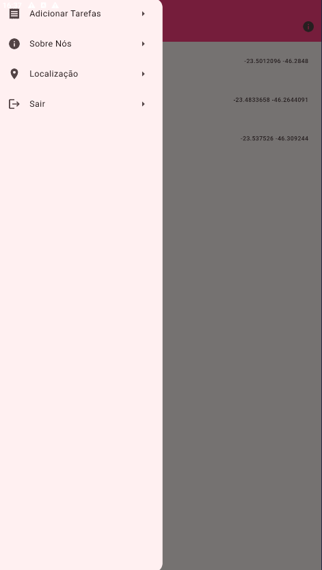

# Victor Pereira Aguiar

Integrações e Publicação de Apps Flutter [24E2_3]

Arquivo app-release.aab está na raiz do projeto

## Prints do Funcionamento do aplicativo

Print Tela de Login

Print Tela de Novo Cadastro

Print Tela cadastro de foto no Novo Cadastro

Print Tela novo cadastro com a foto adicionada

Print Tela Home com a lista de tarefas

Print Tela HOME com meu navegação

Print Tela Cadastro nova Tarefa

Print Tela Editar nova tarefa

Print Tela Informação Localização API HTTP

